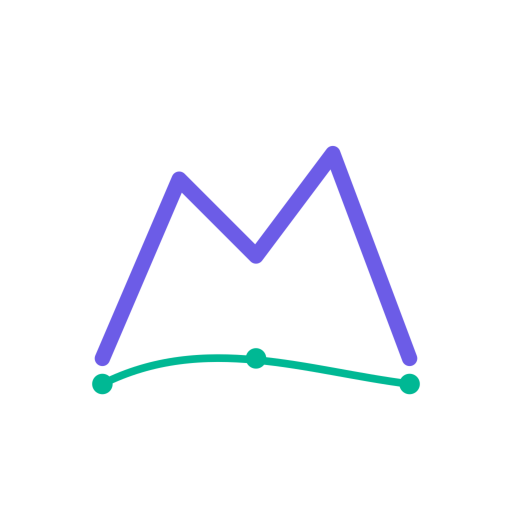

# UltraEdge



**UltraEdge** is an open-source mobile application designed specifically for ultra marathon runners and their support crews. Plan your races, manage aid stations, coordinate your crew, and optimize your performance - all in one comprehensive app.

> Created by an ultra runner, for ultra runners.

## Recent Updates

- **2025-04-08**: Fixed profile data backup issue by adding missing columns to the Supabase database schema

## Latest Features

### Race Planning & Management
- **Create detailed race plans** for ultra marathons and endurance events
- **Customize distance units** (miles/kilometers) and elevation units (feet/meters)
- **Track key race metrics** including distance, elevation gain, and cut-off times
- **Edit and update race plans** as your training and strategy evolve

### Aid Station Management
- **Configure comprehensive aid station details**:
  - Precise location and distance markers
  - Cut-off times and pacing calculations
  - Available supplies and nutrition options
  - Medical support availability
  - Required equipment checks
- **Edit existing aid stations** to refine your race strategy

### Crew Coordination
- **Manage your support crew** with detailed profiles and contact information
- **Assign crew members to specific aid stations** for seamless race-day coordination
- **Add crew instructions** with meeting points, driving directions, and responsibilities
- **Optimize crew logistics** to maximize their effectiveness during your event

### User Experience
- **Personalized user profiles** with customizable preferences
- **Dark mode support** for comfortable viewing in any lighting condition
- **Intuitive navigation** designed for quick access during race planning and execution
- **Responsive design** that works across different device sizes

### Premium Features
- **Cloud synchronization** of all race data across devices
- **Automatic backup** to secure cloud storage after every edit
- **Restore race data** from cloud backups
- **Advanced analytics** and performance insights
- **Unlimited race plans** and aid station configurations
- **Priority support** and early access to new features

## Screenshots

*Note: Screenshots will be added as the app development progresses.*

<!-- 
<div style="display: flex; flex-wrap: wrap; justify-content: space-between;">
    
    
    
</div>
-->

The app includes screens for:
- Home dashboard with upcoming races
- Race creation and editing
- Aid station setup and management
- Crew coordination and assignment
- User profile customization
- Premium subscription management

## Technical Details

- Built with **React Native** for cross-platform compatibility (iOS and Android)
- Implements **React Navigation** for seamless app navigation
- Uses **React Native Paper** for beautiful, consistent UI components
- Stores data locally using **AsyncStorage** for offline functionality
- Integrates with **Supabase** for secure cloud storage and authentication
- Implements **RevenueCat** for subscription management and in-app purchases

## Getting Started

### Prerequisites

- Node.js (v14 or newer)
- npm or yarn
- Expo CLI

### Installation

1. Clone the repository
```bash
git clone https://github.com/beaux-riel/UltraEdge.git
cd UltraEdge
```

2. Install dependencies
```bash
npm install
# or
yarn install
```

3. Configure Supabase (for premium features)
```bash
# See instructions in /supabase/README.md
```

4. Configure RevenueCat (for subscription management)
```bash
# Update API keys in src/context/RevenueCatContext.js
```

5. Start the development server
```bash
npx expo start
```

## Contributing

UltraEdge is an open-source project, and we welcome contributions from the community! Whether you're an ultra runner with ideas for new features, a developer looking to contribute code, or someone who wants to improve documentation, we'd love your help.

### Ways to Contribute

- **Feature Development**: Help build new features or enhance existing ones
- **Bug Fixes**: Identify and fix issues in the codebase
- **Documentation**: Improve README, add code comments, or create user guides
- **Testing**: Test the app in different environments and report issues
- **Design**: Suggest UI/UX improvements or create assets

### Getting Started with Contributing

1. Fork the repository
2. Create a feature branch (`git checkout -b feature/amazing-feature`)
3. Commit your changes (`git commit -m 'Add some amazing feature'`)
4. Push to the branch (`git push origin feature/amazing-feature`)
5. Open a Pull Request

## License

This project is licensed under the MIT License - see the LICENSE file for details.

## Contact

Beaux - [GitHub](https://github.com/beaux-riel)

Project Link: [https://github.com/beaux-riel/UltraEdge](https://github.com/beaux-riel/UltraEdge)
